<nav style="margin-bottom:1.5rem">
  <a href=".">Home</a> &nbsp;|&nbsp;
  <a href="guide">Setup Guide</a> &nbsp;|&nbsp;
  <a href="product-info">Product Information</a> &nbsp;|&nbsp;
  <a href="eula">EULA</a> &nbsp;|&nbsp;
  <a href="terms">Terms &amp; Conditions</a>
</nav>

# Dynamic VAT Management

## General

Dynamic VAT Management is tailored to adjust VAT for international transactions based on the destination.

This module modifies VAT by altering the VAT Business Posting Group in POS transactions.

With the possibility to define several Ports, Routes and Legs, Dynamic VAT Management is able to determine the correct VAT.

This can be managed by either:

- Timetable
- Manual Leg Change

### Timetable

To efficiently manage VAT changes, Dynamic VAT Management provides the capability to upload timetables that specify the necessary data and actions required for VAT adjustments.

In the absence of a timetable, the system defaults to the VAT Business Posting Group defined on the Store Card.

The module does not permit immediate changes to dimensions or other parameters not governed by the VAT posting group.

The module is currently available in English only.

### Manual VAT Change

Disable **Timetable in Use** to manage VAT changes manually.

To change VAT manually, create a POS button using the **DVMCHGLEG** POS command.

> This functionality is not yet implemented.

### Integrations

Dynamic VAT Management provides API integration capabilities with or without timetable usage.

Integration with Blueflow is supported.

> Please submit a support request for technical integration details.

---

# General Setup

Before Dynamic VAT Management can be used, the following master data must be created:

- Vessels
- Routes
- Legs

All routes referenced in timetable files must exist in the Route table before importing.

Otherwise, timetable imports will fail.

> **Note:** Dynamic VAT logic is only active when **DVM Enable** is enabled.

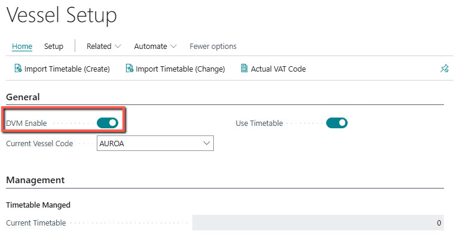

---

## Vessels

All vessels where DVM should control VAT must be created.

The Vessel List is accessible from the Vessel Setup page.

Select **Vessels** to open the vessel list.

### Vessel Fields

| Field | Description |
|---------|-------------|
| Code | LS Central internal vessel code |
| External Code | Code used by external systems |
| Active | Indicates that DVM is enabled for the vessel |
| Description | Vessel name |

---

## Routes

To support VAT management through timetables, routes must be defined before importing schedules.

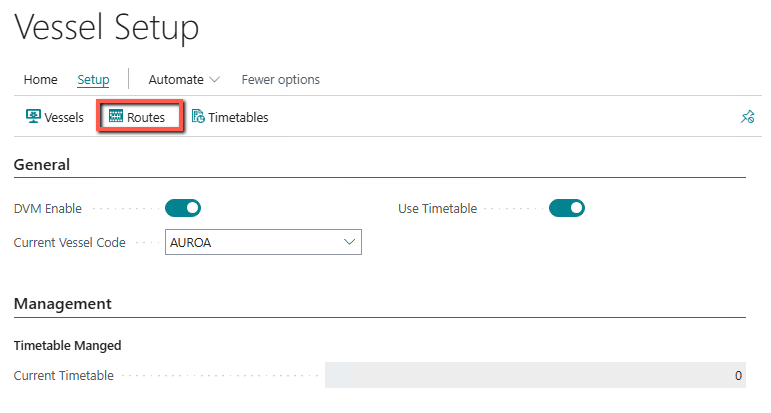

### Route Fields

| Field | Description |
|---------|-------------|
| Code | LS Central internal route code |
| External Code | Code used by external systems |
| Active | Indicates active DVM route |
| Description | Route description |

---

## Legs

Legs define the VAT segments used during travel.

Every route contains one or more legs.

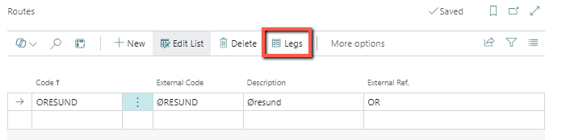

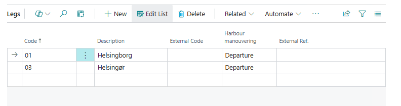

### Leg Fields

| Field | Description |
|---------|-------------|
| Code | LS Central internal leg code |
| Description | Descriptive text |
| External Code | External leg identifier |
| Harbor | Inbound or outbound harbor |
| External Ref. | External integration reference |

---

## VAT Store Groups

For every leg, one or more VAT Business Posting Groups must be defined.

If Store Code is blank, the VAT setup is considered the default configuration.

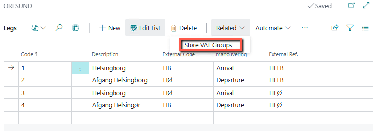

> **Attention:** Best practice is always to create a default VAT setup for each leg.

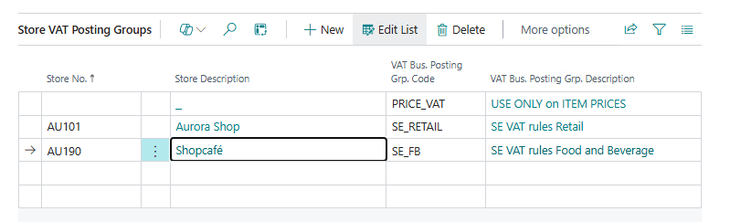

### Store VAT Fields

| Field | Description |
|---------|-------------|
| Store No. | Store identifier |
| Store Description | Store description |
| VAT Bus. Posting Grp. Code | VAT posting group used by the store |
| VAT Bus. Posting Grp. Description | VAT posting group description |

---

# Timetable

RTS VAT Management supports three methods for VAT changes:

1. Timetable
2. Manual input (POS Command)
3. External integrations (e.g. Blueflow)

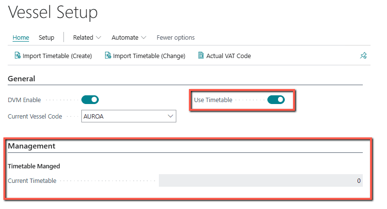

A timetable contains:

- Route
- Leg
- Departure
- Arrival
- Shift Date Time

Based on the Shift Date Time, departure timing is calculated.

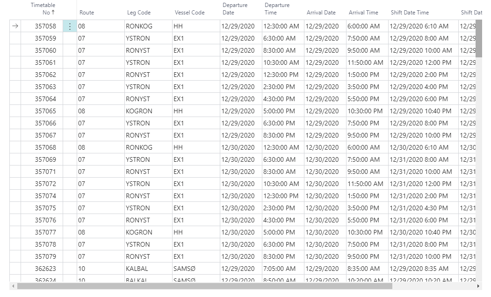

After setup, the **Current Vessel Code** must be selected on Vessel Setup.

The POS uses the current vessel and current leg to determine the correct VAT Business Posting Group.

---

## Manual Timetable Import

Manual timetable imports are performed from Vessel Setup.

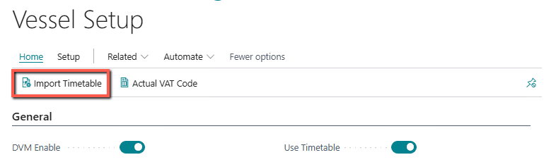

Use **Import Timetable** to load timetable data manually.

> Submit a support request for timetable file format specifications.

---

## Automatic Timetable Import

Timetables can also be imported using the DVM API.

> Submit a support request for API documentation.

---

# No Timetable

DVM can operate without timetable usage.

External applications such as Blueflow can control route and leg changes using the API.

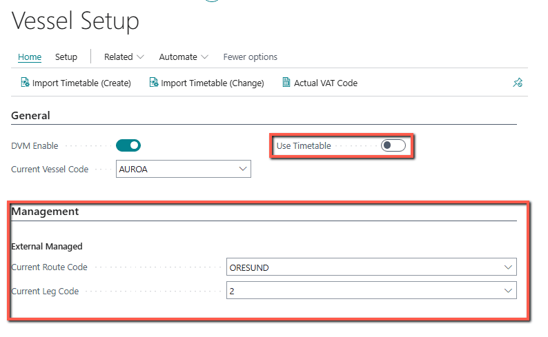

To use DVM without timetables:

- Configure Current Route
- Configure Current Leg

The POS will determine VAT from the Current Leg.

> **Attention:** Default VAT setup must exist for every leg.

---

# POS Command

## Register DVM POS Commands

Open:

**POS External Commands → Register**

Register:

**RTS.DVM External POS Commands**

After registration, **DVM_CHNGLEG** can be assigned to POS buttons.

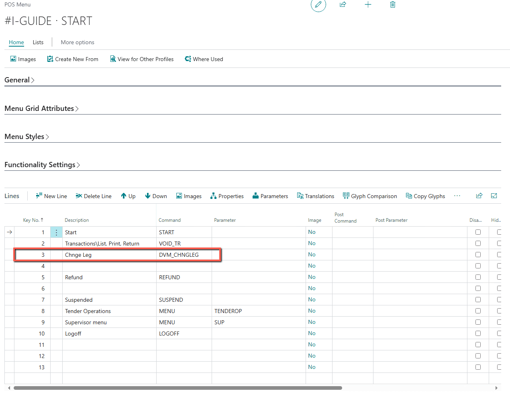

---

## Using DVM_CHNGLEG

When activated, a confirmation dialog is displayed.

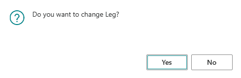

If the user selects **Yes**, the available legs are shown.

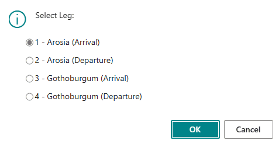

The selected leg is then activated.

The change follows the same process as an API-triggered leg change (e.g. Blueflow).

> Leg changes are not immediate. A Job Queue entry is created and processed almost instantly.

If the leg change does not occur:

- Check Job Queue Entries
- Check Job Queue Errors
- Verify route and leg configuration

---

## Blueflow

Integration with Blueflow and other compatible external systems is supported.

Route and leg updates are received through integrations and reflected in Vessel Setup.

For technical integration details, submit a support request.
